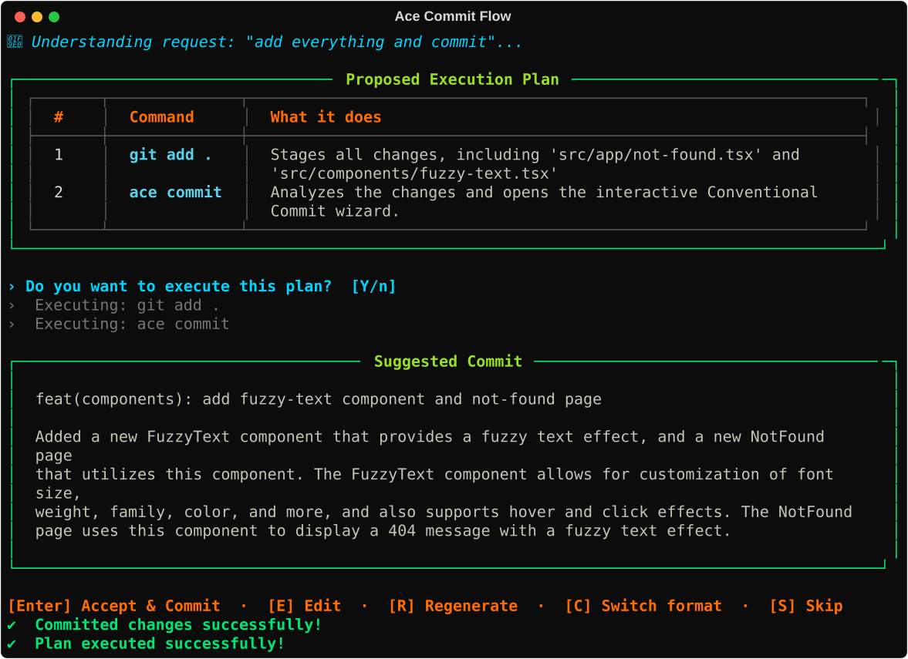
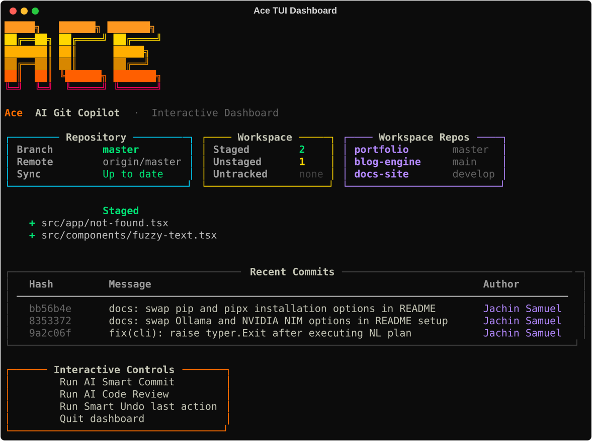
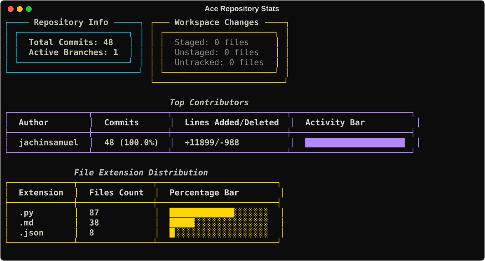

# Ace — AI-Powered Git Copilot
Author: Jachin Samuel <jachinsamuel007@gmail.com>
```text
 █████╗   ██████╗ ███████╗
██╔══██╗ ██╔════╝ ██╔════╝
███████║ ██║      █████╗  
██╔══██║ ██║      ██╔══╝  
██║  ██║ ╚██████╗ ███████╗
╚═╝  ╚═╝  ╚═════╝ ╚══════╝
```

[](https://pypi.org/project/ace-git-copilot/)
[](https://pypi.org/project/ace-git-copilot/)
[](https://pypi.org/project/ace-git-copilot/)
[](https://opensource.org/licenses/MIT)
[](https://github.com/jachinsamuel/Ace/stargazers)
[](https://github.com/jachinsamuel/Ace/issues)

Ace is an intelligent command-line copilot that brings AI assistance directly to your Git workflow. Talk to Git in plain English — Ace translates your intents into Git commands, explains what it is doing, and runs them safely. It also features universal Git command pass-through and an interactive terminal dashboard (TUI) to manage your repositories effortlessly.



---

## Features

*   **Universal Git Pass-Through**: Run ANY standard Git command or custom Git extension directly through Ace (e.g. `ace status`, `ace log --oneline -n 10`, `ace checkout -b feature`, `ace push origin main`, `ace stash pop`).
*   **Natural Language Git Commands**: Translate plain English requests like *"undo my last commit but keep changes"* or *"switch to a new branch called design-updates"* into clean, standard Git operations without needing quotes.
*   **AI-Powered Conventional Commits**: Analyzes staged diffs and generates standardized Conventional Commit messages (`feat:`, `fix:`, `refactor:`, `docs:`, etc.) automatically across both cloud and local offline LLMs.
*   **Custom Shortcuts & Aliases**: Create customized multi-command workflows with `ace alias` (e.g. `ace ship` runs `git add . && ace commit -y && git push`).
*   **Automated Code Review**: Rates code quality on a 10-point scale and identifies bugs, security vulnerabilities, or performance bottlenecks in staged or unstaged diffs.
*   **Interactive Merge Conflict Resolver**: Walks you step-by-step through conflicted files and provides AI-suggested 3-way merged blocks.
*   **Multi-Language / i18n Output**: Localized AI explanations and commit suggestions in 15+ languages (English, Chinese, Spanish, French, German, Japanese, Korean, Hindi, and more).
*   **Interactive TUI Dashboard (`ace dash`)**: Real-time terminal repository browser displaying branch status, commit logs, workspace navigation, and interactive menus.
*   **Repository Health Doctor (`ace doctor`)**: Detects active lock files, detached HEAD states, and oversized untracked files with step-by-step AI recovery guidance.
*   **AI Git Blame (`ace blame`)**: Inspects commit history and diff patches to explain *why* a specific line of code was written or modified.
*   **Rich Repo Statistics (`ace stats`)**: Visualizes commit frequency charts, top contributors, and repository language/extension breakdowns.
*   **Automated Release Changelogs (`ace changelog`)**: Compiles categorized release changelogs in Markdown since the previous tag.
*   **Multi-Repo Daily Standups (`ace standup`)**: Generates structured summaries of your recent contributions across one or more repositories.
*   **Smart Git Hooks (`ace hook`)**: One-command installation for pre-commit review checks and prepare-commit-msg AI drafting.
*   **AI Branch Auto-Squashing (`ace squash`)**: Automatically analyzes commit histories and guides clean interactive rebases.
*   **Built-in Safety System**: Classifies actions into safe, moderate, and destructive tiers with automatic stashing and interactive confirmation guards.

---

## Installation

### Option A: Install via standard pip (Recommended)
```bash
pip install ace-git-copilot
```

*Note: You can also execute Ace directly through Python module execution:*
```bash
python -m ace dash
```

### Option B: Install via pipx (Isolated Environment)
[pipx](https://pypa.github.io/pipx/) installs the CLI in an isolated virtual environment and adds the binary globally:

```bash
pip install pipx
pipx ensurepath
pipx install ace-git-copilot
```

---

## Configuration and AI Providers

Launch the interactive configuration wizard:
```bash
ace setup
```

Ace stores your configuration at `~/.ace/config.toml`. It supports 6 AI model backends:

| Provider | Type | Default Model | Key / URL Setup |
|:---|:---|:---|:---|
| **NVIDIA NIM** | Cloud (Fast) | `meta/llama-3.1-8b-instruct` | `NVIDIA_API_KEY` (Free at [build.nvidia.com](https://build.nvidia.com/)) |
| **Ollama** | Local (Private/Offline) | `qwen2.5-coder:7b` | `http://localhost:11434` (Auto-pulled) |
| **Google Gemini** | Cloud | `gemini-1.5-flash` | `GOOGLE_API_KEY` / `GEMINI_API_KEY` |
| **OpenAI** | Cloud | `gpt-4o-mini` | `OPENAI_API_KEY` |
| **Anthropic** | Cloud | `claude-3-5-sonnet-latest` | `ANTHROPIC_API_KEY` |
| **Custom OpenAI-Compatible** | Cloud / Self-hosted | `custom-model` | `CUSTOM_API_KEY` + `CUSTOM_API_BASE` |

You can also switch providers directly in the CLI:
```bash
ace config
```

---

## Usage Guide

### 1. Plain-English Natural Language
Speak to Git in plain English directly without quotes:
```bash
ace stage everything and commit with a message about authentication
ace undo my last commit but keep the files
ace switch to a new branch called design-updates
```

### 2. Custom Shortcuts (`ace alias`)
Run pre-configured shortcuts or define your own multi-step workflows:
```bash
# Run default shortcut (stages, commits with AI, and pushes)
ace ship

# Create custom shortcut
ace alias add deploy "git add . && ace commit -y && git push origin staging"

# List all shortcuts
ace alias list
```

### 3. Command-Line Reference

| Command | Alias / Shorthand | Description |
|:---|:---|:---|
| `ace setup` | — | Interactive setup wizard for model providers and language. |
| `ace stage [files]` | `ace add` | Stage specific files or all untracked changes. |
| `ace commit` | — | AI Conventional Commit generator (`-y` to skip confirmation). |
| `ace review` | — | Run AI code review & quality scoring (`--strict` for pre-commit). |
| `ace resolve` | — | Interactive 3-way merge conflict resolver. |
| `ace explain <query>` | — | Explain Git concepts, error messages, or commands. |
| `ace doctor` | — | Run repository diagnostics (locks, detached HEAD, large files). |
| `ace hook <action>` | — | Install or uninstall pre-commit and prepare-commit-msg hooks. |
| `ace stats` | — | Visualize repository activity, contributors, and extensions. |
| `ace changelog` | — | Generate categorized release notes since last tag. |
| `ace standup` | — | Generate structured daily standup report from recent commits. |
| `ace blame <file> <line>`| — | Explain the purpose and context behind a specific line of code. |
| `ace pr` | — | Draft a Markdown pull request title and description. |
| `ace search <query>` | — | Semantically search commit history with interactive checkout. |
| `ace squash` | — | Analyze branch history and perform AI-guided rebasing. |
| `ace ignore <pattern>` | — | Generate and append rules to `.gitignore`. |
| `ace alias <action>` | — | Manage custom command workflows (`list`, `add`, `remove`). |
| `ace undo` | — | Safely roll back the previous Git action with automated safety checks. |
| `ace workspace` | `ace ws` | Multi-repository cockpit to monitor workspace directories. |
| `ace dash` | — | Launch the interactive Terminal User Interface (TUI). |
| `ace config` | — | View active configuration settings and active provider. |
| `ace help` | — | Display command reference and usage guide. |

---

## Interactive Terminal Dashboard (TUI)

Launch the repository management cockpit:
```bash
ace dash
```



---

## Repository Statistics (`ace stats`)

View visual commit timelines, contributor breakdowns, and file extension distributions:



## License

Distributed under the MIT License. See [LICENSE](LICENSE) for more details.
